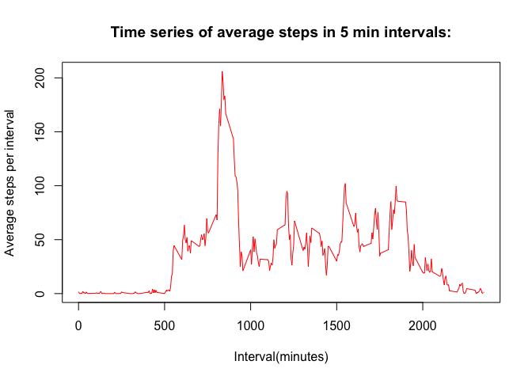
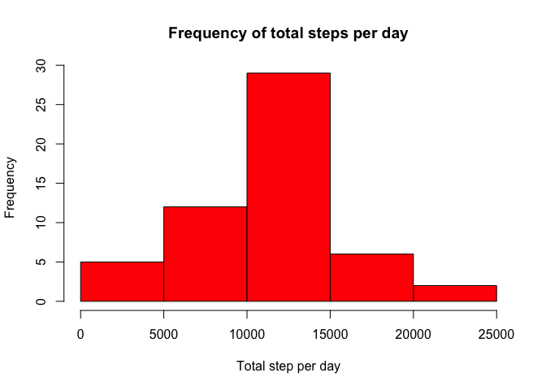

## Loading and preprocessing the data
First, I'm going to read the csv file and assign it to 'activity'.

```r
activity<-read.csv("./activity.csv")
```


## What is mean total number of steps taken per day?
To measure the mean total number of steps per day, I will use the tapply function with the arguments steps of the activity table and results of total step counts will be grouped by the date index.  
Finally, the sum will be calculated while removing missing values, the table will be assigned to the CountSteps.

```r
CountSteps<-tapply(activity$steps,activity$date,sum,rm.na=TRUE)
```
Here is an histogram for the data:  

```r
hist(CountSteps,col="blue",xlab="Total step per day",main="Frequency of total steps per day")
```

<!-- -->
  
And to calculate the mean of steps per day, I will use the summary function on CounSteps.

```r
summary(CountSteps)
```

```
##    Min. 1st Qu.  Median    Mean 3rd Qu.    Max.    NA's 
##      42    8842   10766   10767   13295   21195       8
```

## What is the average daily activity pattern?
In order to present a plot showing the average steps per interval, I'll create a table consisting of 'AverageSteps' which represent the average steps per interval across all days, and 'Interval' a vector of the levels of the factor variable of time intervals.

```r
AverageSteps<-tapply(activity$steps,activity$interval,mean,na.rm=TRUE)
Interval<-as.factor(activity$interval)
Interval<-(as.numeric(levels(Interval)))
StepsInterval<-cbind(Interval,AverageSteps)
StepsInterval<-data.frame(StepsInterval)
```
Then, I'll create a plot depicting the mean steps per time interval:  

```r
plot(StepsInterval[,1],StepsInterval[,2],type="l",xlab="Interval(minutes)",ylab="Average steps per interval",main="Time series of average steps in 5 min intervals:",col="red")
```

<!-- -->
    
For the interval which has the maximum value of average steps, I'll use which.max function to find the specific index corresponding to the max average steps.  
Then I'll find the suitable interval.

```r
MaxStep<-which.max(StepsInterval$AverageSteps)
MaxInterval<-StepsInterval$Interval[MaxStep]
```
## Imputing missing values
To calculate the total number of missing values, is.na function will be used to generate a logical vector and then the number of missing values will be measured by the length of the 'missing' variable.

```r
missing<-activity$steps[is.na(activity$steps)]
length(missing)
```

```
## [1] 2304
```
In order to fill the missing values, a mutate function (of dplyr the package) will search where the steps variable is missing, then it will be filled with the average steps across all days for that particular interval. To this end, 'ifelse' function will be used. 

```r
library(dplyr)
```

```
## 
## Attaching package: 'dplyr'
```

```
## The following objects are masked from 'package:stats':
## 
##     filter, lag
```

```
## The following objects are masked from 'package:base':
## 
##     intersect, setdiff, setequal, union
```

```r
activity_Update<-data.frame()
activity_Update<-mutate(activity,replace_steps=ifelse(is.na(activity$steps),StepsInterval$AverageSteps[which(StepsInterval$Interval==activity$interval)],steps))
```
Now, with the new data set assigned 'activity_Update' the sum of total number of steps per day will be calculated again by the 'tapply' function.

```r
CountSteps_Update<-tapply(activity_Update$replace_steps,activity_Update$date,sum,rm.na=TRUE)
hist(CountSteps_Update,col="red",xlab="Total step per day",main="Frequency of total steps per day")
```

<!-- -->
For calculating the median and mean of the new variable we will use the summary function, vs. the previous variable (with the missing values removed).

```r
summary(CountSteps_Update)
```

```
##    Min. 1st Qu.  Median    Mean 3rd Qu.    Max.    NA's 
##      42    8861   10767   10767   13192   21195       7
```

```r
summary(CountSteps)
```

```
##    Min. 1st Qu.  Median    Mean 3rd Qu.    Max.    NA's 
##      42    8842   10766   10767   13295   21195       8
```
It seems that the histogram and the mean/median variables are pretty closed.
## Are there differences in activity patterns between weekdays and weekends?
weekdays() function will be used to extract the day of the week of the date, it will be assigned to the variable days. Them it will be converted to factor variable with 2 levels for weekdays and weekends.
Finally, a column for the 'days' factor variable will be added to the activity_Updated, this table will be called 'final'. 

```r
days<-weekdays(as.Date(activity_Update$date))
days<-as.factor(days)
days <- factor(days, levels = c("Friday","Monday","Thursday","Tuesday","Wednesday","Saturday","Sunday"), labels = c("weekdays", "weekdays","weekdays","weekdays","weekdays","weekends", "weekends"))
final<-cbind(activity_Update,days)
finalsplit<-split(final,days)
```
At last a time series will be formed, like it was plotted in the previous section.

```r
AverageS1<-tapply((finalsplit$weekdays)$replace_steps,(finalsplit$weekdays)$interval,mean,na.rm=TRUE)
Interval1<-as.factor((finalsplit$weekdays)$interval)
Interval1<-(as.numeric(levels(Interval1)))
StepsInterval1<-cbind(Interval1,AverageS1)
StepsInterval1<-data.frame(StepsInterval1)

AverageS2<-tapply((finalsplit$weekends)$replace_steps,(finalsplit$weekends)$interval,mean,na.rm=TRUE)
Interval2<-as.factor((finalsplit$weekends)$interval)
Interval2<-(as.numeric(levels(Interval2)))
StepsInterval2<-cbind(Interval2,AverageS2)
StepsInterval2<-data.frame(StepsInterval2)
```
And the actual panel plotting is as follows:

```r
par(mfrow=c(1,2))
plot(StepsInterval1[,1],StepsInterval1[,2],type="l",xlab="Interval(minutes)",ylab="Average steps per interval",main="Weekdays",col="red")
plot(StepsInterval2[,1],StepsInterval2[,2],type="l",xlab="Interval(minutes)",ylab="Average steps per interval",main="Weekends",col="blue")
```

<!-- -->
